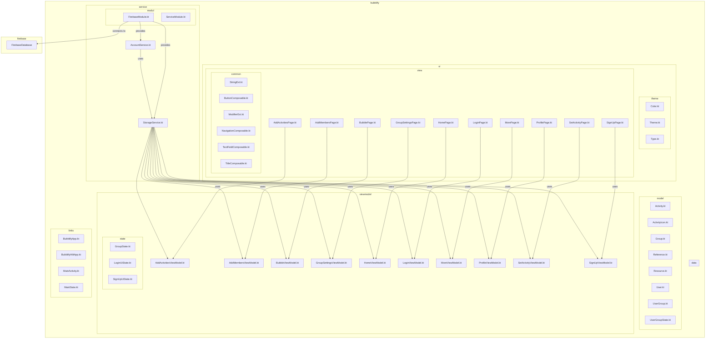
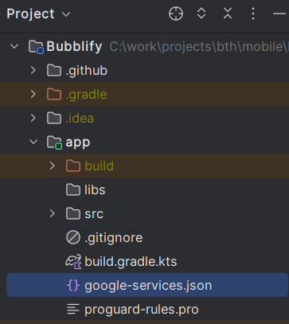
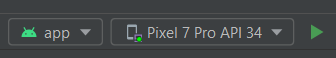

# Bubblify

## Introduction

TODO: Add brief introduction.

TODO: Add image that helps to understand the project.
This could be an architectural diagram or a screenshot of the application.

## Architecture Overview (optional)


### Folder Structure
Folder structure of the project
```
bubblify/
├───app/
│   ├───build/
│   └───src/
│       ├───androidTest/      
│       ├───main/
│       │   ├───java/com/example/
│       │   │   └───bubblify/
│       │   │       │   BubblifyApp.kt        <-- Routes/NavigationHost
│       │   │       │   BubblifyHiltApp.kt    <-- ??
│       │   │       │   MainActivity.kt       <-- Main file that be launched
│       │   │       │   MainState.kt          <-- ??
│       │   │       │
│       │   │       ├───common/           <-- Checking fields input
│       │   │       │
│       │   │       ├───data/            
│       │   │       ├───model/            <-- All the data layer
│       │   │       │
│       │   │       ├───service/          <-- service to interact with database (get/delete...)
│       │   │       │
│       │   │       ├───ui/               <-- all the defaults color, ui elements...
│       │   │       │   └───theme/
│       │   │       │
│       │   │       ├───view/             <-- all the view's (UI part)
│       │   │       │   └───common/       <-- some componants that can be used in View's
│       │   │       │
│       │   │       └───viewmodel/        <-- all the ViewModels (Fetching methods synchronized with the View)
│       │   │           └───state/
│       │   └───res/
│       └───test/
├───build/
├───gradle/
└───resources/
```

## How to Use

### Prerequisites

- Checkout repo
- Open project in Android Studio
- Have access to the [Bubblify Firebase Project](https://console.firebase.google.com/u/0/project/bubblify-226b3)

### Gradle Build

> .\gradlew build

### Test

> .\gradlew app:testReleaseUnitTest

or
> .\gradlew app:testDebugUnitTest

### Setup Firebase connection

- Download the `google-services.json` file from the [Firebase settings](https://console.firebase.google.com/u/0/project/bubblify-226b3/settings/general/android:com.example.bubblify)
- Add it in the `/app` folder. 



### Run

The app can only be run on an android device.
You can run it on an Android emulator or personal android device.

- Go to the "Device Manager"
- Select a virtual or physical device
- Run the app with the blue arrow on top in Android Studio or press "Shift + F10"




For further information consult the docs:
https://developer.android.com/studio/run

## License

Copyright (c) 2023 Bubblify

This work is licensed under [MIT License](./LICENSE).
