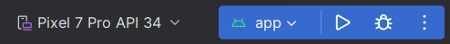

# Bubblify

## Introduction

TODO: Add brief introduction.

TODO: Add image that helps to understand the project.
This could be an architectural diagram or a screenshot of the application.

## Architecture Overview (optional)

TODO: Add simple diagram that explains the architecture.

## How to Use

### Prerequisites

- Checkout repo
- Open project in Android Studio
- Run gradle build
- Run app

### Gradle Build

> .\gradlew build

### Test

> .\gradlew app:testReleaseUnitTest

or
> .\gradlew app:testDebugUnitTest

### Run

The app can only be run on an android device.
You can run it on an Android emulator or personal android device.

- Go to the "Device Manager"
- Select a virtual or physical device
- Run the app with the green arrow or press shift + F10

For further information consult the docs:
https://developer.android.com/studio/run

## License

Copyright (c) 2023 Bubblify

This work is licensed under [MIT License](./LICENSE).